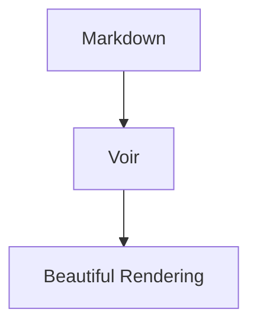

# Voir

> **🇯🇵 [日本語](#日本語) | 🇬🇧 [English](#english)**

---

<a id="日本語"></a>

<details open>
<summary><h2>🇯🇵 日本語</h2></summary>

**Windows 向けの高速な Markdown ビューワー**

Voir（フランス語で「見る」）は、Markdown を**読む**ことに特化した Windows 向けネイティブアプリです。エディタではありません。Rust + Tauri v2 で構築されており、起動も描画も軽快で、完全オフラインで動作します。

---

### 主な機能

#### GitHub スタイルのレンダリング

公式 [github-markdown-css](https://github.com/sindresorhus/github-markdown-css) を使用し、GitHub と同じ見た目で Markdown を表示します。

- テーブル、タスクリスト、取り消し線、オートリンク
- GitHub Alerts（NOTE, TIP, IMPORTANT, WARNING, CAUTION）— pulldown-cmark ネイティブ対応
- YAML フロントマター（折りたたみ可能なテーブル表示）
- 見出しアンカーリンク

#### シンタックスハイライト

highlight.js による多言語対応のシンタックスハイライト。各コードブロックにコピーボタン付き。

#### Mermaid ダイアグラム

````

````

Mermaid コードブロックは自動でダイアグラムにレンダリングされます。クリックで拡大ビューワーが開きます。テーマ切替時も安定して再レンダリングされます。

#### KaTeX 数式

インライン数式 `$E = mc^2$` とブロック数式 `$$...$$` の両方に対応。クリックで拡大表示。

#### ナビゲーション

- **ファイルエクスプローラ** — サイドバーにディレクトリツリーを表示。ディレクトリ履歴（◀▶）対応
- **ブックマーク** — ファイル/ディレクトリを右クリックで登録。サイドバー上部に表示
- **目次パネル（TOC）** — 見出しから自動生成。スクロール追従付き（最下部でも安定）
- **ドキュメント履歴** — Alt+← / Alt+→ で戻る / 進む

#### 検索

`Ctrl+F` で通常検索。**ピン留め検索**で複数キーワードを最大5色で色分けハイライトし続けます。

#### タブ管理

複数ファイルをタブで開いて切り替え可能。右クリックメニューから：
- ピン留めタブ（閉じるボタン非表示、Close All でも残る）
- 他を閉じる / すべて閉じる

#### 拡大ビューワー

Mermaid 図・KaTeX 数式・画像をクリックすると専用ビューワーが開きます：
- マウスホイール / ボタンでズーム
- マウスドラッグでパン
- 画像としてコピー / SVG・画像として保存
- Escape または背景クリックで閉じる

#### スマートコンテキストメニュー

右クリックで状況に応じたメニューを表示：

| クリック先 | 表示されるメニュー |
|-----------|-----------------|
| テキスト選択時 | コピー、ドキュメント内で検索、ピン留めハイライト |
| コードブロック | コードをコピー |
| テーブル | CSV / TSV / Markdown としてコピー |
| 画像 | ビューワーで開く、画像コピー、保存 |
| Mermaid 図 | ビューワーで開く、画像コピー、SVG 保存 |
| KaTeX 数式 | ビューワーで開く、LaTeX コピー |
| リンク | URL コピー |
| 共通 | ファイルパス（行番号付き）コピー、ブックマーク追加 |

#### 設定画面

`Ctrl+,` またはツールバーの⚙アイコンで設定画面を開けます：
- **言語** — 日本語 / English（UI 全体が即座に切り替わる）
- **テーマ** — ライト / ダーク / 自動（OS 連動）
- **フォントサイズ** — 12px 〜 24px スライダー
- **起動時サイドバー表示** — ON/OFF
- **起動時目次表示** — ON/OFF

設定は自動保存され、次回起動時に復元されます。

#### 多言語対応（i18n）

UI のすべてのテキスト（ツールバー、メニュー、設定画面、エラーメッセージ等）が日本語と英語に対応しています。設定画面の「言語」セレクトで切り替え可能です。

#### その他

- **ダークモード** — OS テーマに自動連動。手動切り替えも可能
- **ファイル監視** — 外部で変更されると自動リロード（デバウンス付き）
- **ドラッグ & ドロップ** — `.md` ファイルをウィンドウにドロップ
- **シングルインスタンス** — 2つ目の起動は既存ウィンドウにファイルが送られる
- **CLI 対応** — `voir README.md`、`voir docs/`、`voir --directory=C:\docs`
- **完全オフライン** — highlight.js / Mermaid / KaTeX / フォントすべてが exe に内蔵

---

### インストール

#### インストーラー

`Voir_0.1.0_x64-setup.exe`（NSIS）または `Voir_0.1.0_x64_en-US.msi`（MSI）を実行。

#### ポータブル

`Voir.exe` 単体でも動作します（WebView2 がシステムにあれば）。

#### ソースからビルド

```powershell
git clone https://github.com/Sakaguchi-softemcom/voir.git
cd voir
npm install
npm run build
```

詳細は [BUILD_SETUP.md](./BUILD_SETUP.md) を参照してください。

---

### キーボードショートカット

| ショートカット | 機能 |
|---|---|
| `Ctrl+O` | ファイルを開く |
| `Ctrl+F` | ページ内検索 |
| `Ctrl+B` | サイドバー切り替え |
| `Ctrl+W` | タブを閉じる |
| `Ctrl+R` | 再読み込み |
| `Alt+←` / `Alt+→` | 戻る / 進む |
| `Ctrl++` / `Ctrl+-` | ズーム |
| `Ctrl+0` | ズームリセット |
| `Ctrl+,` | 設定画面 |
| `Escape` | 検索 / 設定 / ビューワーを閉じる |

---

### 技術スタック

| レイヤー | 技術 |
|---|---|
| コア | Rust |
| UI フレームワーク | Tauri v2 |
| Markdown パース | pulldown-cmark（GFM + ネイティブ Alerts） |
| シンタックスハイライト | highlight.js（esbuild でバンドル） |
| ダイアグラム | Mermaid |
| 数式 | KaTeX（フォント含む） |
| CSS | github-markdown-css (sindresorhus) |
| ファイル監視 | notify |
| CLI | clap |
| シングルインスタンス | tauri-plugin-single-instance |
| インストーラー | NSIS / MSI |

---

### 開発

```powershell
npm run dev       # 開発モード
npm run build     # リリースビルド
cd src-tauri && cargo test  # テスト
```

詳細は [DEVELOPMENT.md](./DEVELOPMENT.md) を参照してください。

---

### ライセンス

MIT

</details>

---

<a id="english"></a>

<details>
<summary><h2>🇬🇧 English</h2></summary>

**A fast, native Markdown viewer for Windows.**

Voir (French for "to see") is a native Windows application focused on **reading** Markdown. It is not an editor. Built with Rust + Tauri v2 for instant startup, smooth rendering, and fully offline operation.

---

### Features

#### GitHub-Style Rendering

Uses the official [github-markdown-css](https://github.com/sindresorhus/github-markdown-css) to display Markdown exactly as it appears on GitHub.

- Tables, task lists, strikethrough, autolinks
- GitHub Alerts (NOTE, TIP, IMPORTANT, WARNING, CAUTION) — native pulldown-cmark support
- YAML frontmatter (collapsible table display)
- Heading anchor links

#### Syntax Highlighting

Multi-language syntax highlighting via highlight.js. Each code block includes a copy button.

#### Mermaid Diagrams

````

````

Mermaid code blocks are automatically rendered as diagrams. Click to open a zoom viewer. Stable re-rendering on theme switch.

#### KaTeX Math

Supports both inline `$E = mc^2$` and block `$$...$$` math. Click to enlarge.

#### Navigation

- **File Explorer** — Directory tree in sidebar with directory history (◀▶)
- **Bookmarks** — Right-click to bookmark files/directories. Shown at sidebar top
- **Table of Contents (TOC)** — Auto-generated from headings with scroll tracking (stable at bottom)
- **Document History** — Alt+←/→ to navigate back/forward

#### Search

`Ctrl+F` for page search. **Pinned search** keeps up to 5 keywords highlighted in different colors.

#### Tab Management

Open multiple files in tabs. Right-click menu provides:
- Pin tab (survives Close All)
- Close Others / Close All

#### Zoom Viewer

Click on Mermaid diagrams, KaTeX formulas, or images to open a dedicated viewer:
- Mouse wheel / buttons for zoom
- Mouse drag for pan
- Copy as image / Save as SVG or image
- Escape or backdrop click to close

#### Smart Context Menu

Right-click shows context-aware options:

| Target | Menu Items |
|--------|-----------|
| Text selection | Copy, Search in document, Pin highlight |
| Code block | Copy code |
| Table | Copy as CSV / TSV / Markdown |
| Image | Open in viewer, Copy image, Save |
| Mermaid diagram | Open in viewer, Copy as image, Save SVG |
| KaTeX formula | Open in viewer, Copy LaTeX |
| Link | Copy URL |
| General | Copy file path (with line number), Add bookmark |

#### Settings

Open with `Ctrl+,` or the ⚙ toolbar icon:
- **Language** — Japanese / English (entire UI switches instantly)
- **Theme** — Light / Dark / Auto (follows OS)
- **Font size** — 12px to 24px slider
- **Sidebar on startup** — ON/OFF
- **TOC on startup** — ON/OFF

Settings are auto-saved and restored on next launch.

#### Internationalization (i18n)

All UI text (toolbar, menus, settings, error messages, etc.) is available in Japanese and English. Switch via the Language selector in Settings.

#### Other Features

- **Dark mode** — Auto-follows OS theme with manual toggle
- **File watching** — Auto-reloads on external changes (debounced)
- **Drag & drop** — Drop `.md` files onto the window
- **Single instance** — Second launch sends files to existing window
- **CLI support** — `voir README.md`, `voir docs/`, `voir --directory=C:\docs`
- **Fully offline** — highlight.js / Mermaid / KaTeX / fonts all embedded in exe

---

### Installation

#### Installer

Run `Voir_0.1.0_x64-setup.exe` (NSIS) or `Voir_0.1.0_x64_en-US.msi` (MSI).

#### Portable

`Voir.exe` works standalone (requires WebView2 on system).

#### Build from Source

```powershell
git clone https://github.com/Sakaguchi-softemcom/voir.git
cd voir
npm install
npm run build
```

See [BUILD_SETUP.md](./BUILD_SETUP.md) for detailed setup instructions.

---

### Keyboard Shortcuts

| Shortcut | Action |
|---|---|
| `Ctrl+O` | Open file |
| `Ctrl+F` | Find in page |
| `Ctrl+B` | Toggle sidebar |
| `Ctrl+W` | Close tab |
| `Ctrl+R` | Reload |
| `Alt+←` / `Alt+→` | Back / Forward |
| `Ctrl++` / `Ctrl+-` | Zoom in / out |
| `Ctrl+0` | Reset zoom |
| `Ctrl+,` | Settings |
| `Escape` | Close search / settings / viewer |

---

### Tech Stack

| Layer | Technology |
|---|---|
| Core | Rust |
| UI Framework | Tauri v2 |
| Markdown Parsing | pulldown-cmark (GFM + native Alerts) |
| Syntax Highlighting | highlight.js (esbuild bundle) |
| Diagrams | Mermaid |
| Math | KaTeX (with fonts) |
| CSS | github-markdown-css (sindresorhus) |
| File Watching | notify |
| CLI | clap |
| Single Instance | tauri-plugin-single-instance |
| Installer | NSIS / MSI |

---

### Development

```powershell
npm run dev       # Dev mode
npm run build     # Release build
cd src-tauri && cargo test  # Tests
```

See [DEVELOPMENT.md](./DEVELOPMENT.md) for details.

---

### License

MIT

</details>
