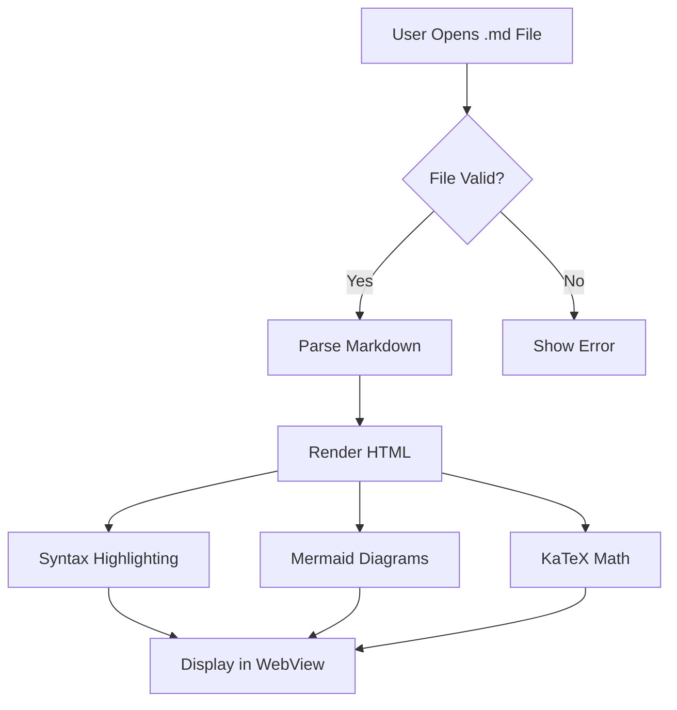
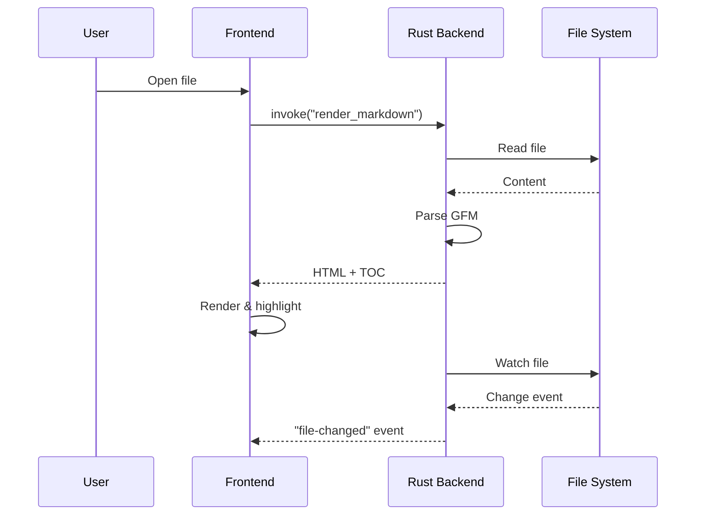

# Voir Feature Test

This document tests all of Voir's rendering capabilities.

## Text Formatting

This is **bold**, this is *italic*, this is ~~strikethrough~~, and this is `inline code`.

Here's a [link to GitHub](https://github.com) and an autolink: https://example.com

## Lists

### Unordered

- Item one
- Item two
  - Nested item
  - Another nested
- Item three

### Ordered

1. First
2. Second
3. Third

### Task List

- [x] Build Markdown parser
- [x] Implement syntax highlighting
- [ ] Add print support
- [ ] Publish to winget

## Blockquote

> "The best way to predict the future is to invent it."
> — Alan Kay

## GitHub Alerts

> [!NOTE]
> This is a note alert. Useful information that users should know.

> [!TIP]
> This is a tip. Helpful advice for doing things better or more easily.

> [!IMPORTANT]
> This is important. Key information users need to know.

> [!WARNING]
> This is a warning. Urgent info that needs immediate attention.

> [!CAUTION]
> This is a caution. Negative potential consequences of an action.

## Table

| Feature | Voir | Arto |
|---------|------|------|
| Platform | Windows | macOS |
| Framework | Tauri v2 | Native Cocoa |
| Language | Rust | Rust |
| GFM Support | ✅ | ✅ |
| Mermaid | ✅ | ✅ |
| KaTeX | ✅ | ✅ |

## Code Blocks

### Rust

```rust
fn main() {
    let greeting = "Hello, Voir!";
    println!("{greeting}");

    let numbers: Vec<i32> = (1..=10)
        .filter(|n| n % 2 == 0)
        .collect();

    for n in &numbers {
        println!("{n}");
    }
}
```

### TypeScript

```typescript
interface MarkdownResult {
  html: string;
  toc: TocEntry[];
  title: string;
  frontmatter?: string;
}

async function renderMarkdown(path: string): Promise<MarkdownResult> {
  return await invoke('render_markdown', { path });
}
```

### PowerShell

```powershell
# Open a file with Voir
$file = Get-ChildItem *.md | Select-Object -First 1
Start-Process voir -ArgumentList $file.FullName
```

## Mermaid Diagram





## Math (KaTeX)

Inline math: $E = mc^2$ and $\sum_{i=1}^{n} i = \frac{n(n+1)}{2}$

Block math:

$$
\int_{-\infty}^{\infty} e^{-x^2} dx = \sqrt{\pi}
$$

$$
\mathbf{A} = \begin{pmatrix} a_{11} & a_{12} \\ a_{21} & a_{22} \end{pmatrix}
$$

## Images


## Horizontal Rule

---

## Footnotes

This has a footnote[^1] and another one[^2].

[^1]: First footnote content.
[^2]: Second footnote with more detail.

## Long Content for Scroll Testing

Lorem ipsum dolor sit amet, consectetur adipiscing elit. Sed do eiusmod tempor incididunt ut labore et dolore magna aliqua. Ut enim ad minim veniam, quis nostrud exercitation ullamco laboris nisi ut aliquip ex ea commodo consequat.

Duis aute irure dolor in reprehenderit in voluptate velit esse cillum dolore eu fugiat nulla pariatur. Excepteur sint occaecat cupidatat non proident, sunt in culpa qui officia deserunt mollit anim id est laborum.

### Sub-section A

Content for sub-section A. This helps test the TOC scroll-spy functionality.

### Sub-section B

Content for sub-section B. More text here to create scrollable content.

### Sub-section C

Content for sub-section C. The table of contents should highlight each section as you scroll through.

---

*End of test document. All features should render correctly above.*
